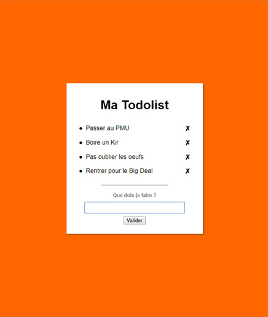
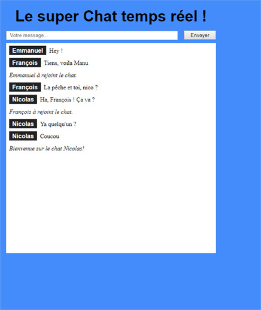

## Todolist & Chat

 

  
  

_Exercices from [Open Classrooms](https://openclassrooms.com/courses/des-applications-ultra-rapides-avec-node-js)._

You will need [NodeJS](https://nodejs.org/en/) and run <code>npm install</code> then <code>npm start</code> in each folder if you want to try it.
